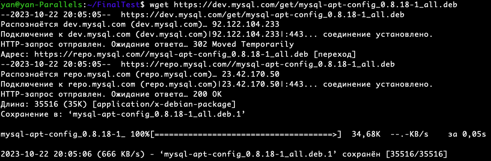
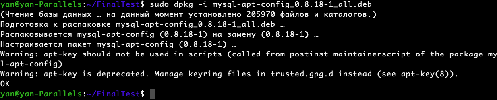
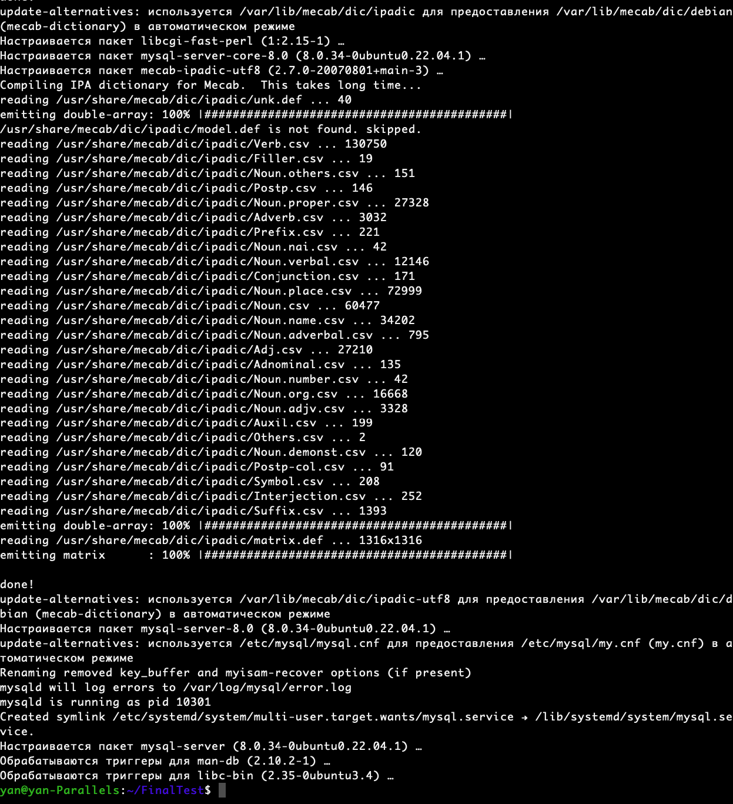

# Подключение дополнительного репозитория MySQL
Добавляю репозиторий MySQL в систему. Для этого выполняю следующую команду:
```
sudo dpkg -i mysql-apt-config_0.8.18-1_all.deb
```


Устанавливаю скачанный пакет выполнив команду
```
sudo dpkg -i mysql-apt-config_0.8.18-1_all.deb
```


Обновляю список пакетов:
```
sudo apt update
```
Устанавливаю часть пакета - MySQL-Sever:
```
sudo apt install mysql-server
```

