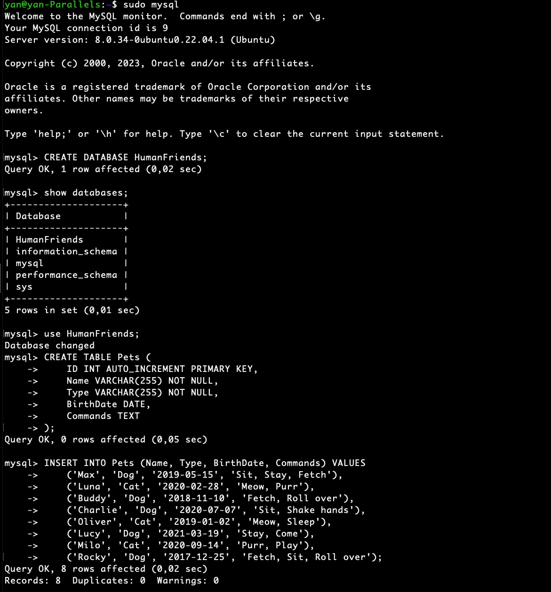
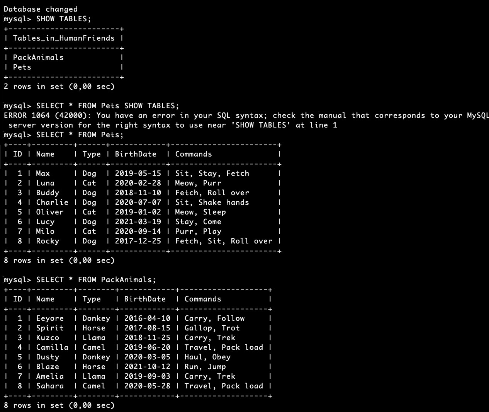
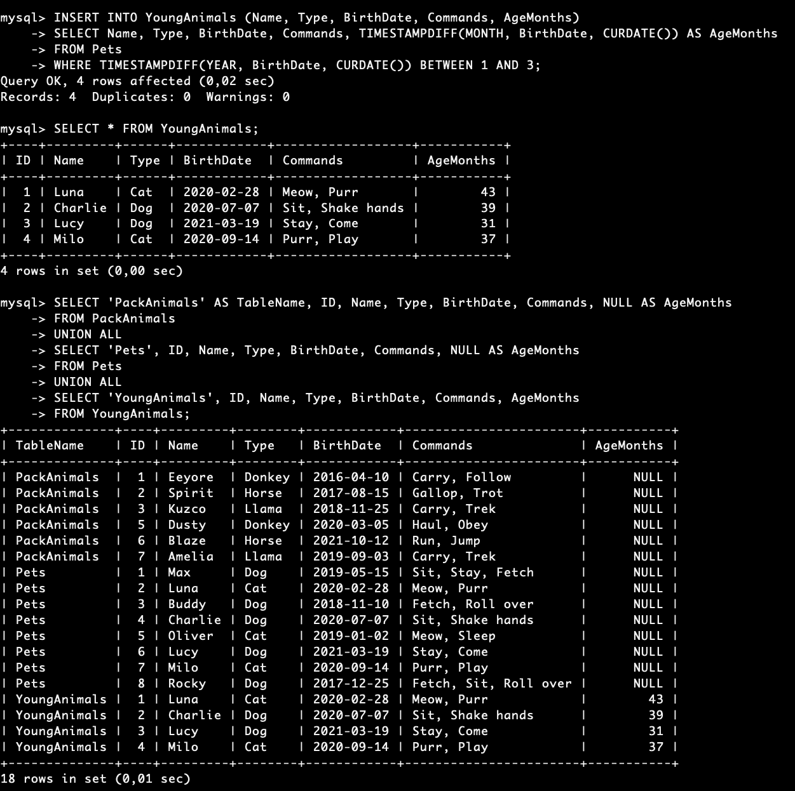

# Работа с MySQL 
Вхожу в систему MySQL c паролем root
```
sudo mysql
```
СОздаю новую базу данных HumanFriends:
```
CREATE DATABASE HumanFriends;
```
Выбираю базу данных HumanFriends
```
USE HumanFriends;
```
Создаю таблицу животных Pets
```
CREATE TABLE Pets (
    ID INT AUTO_INCREMENT PRIMARY KEY,
    Name VARCHAR(255) NOT NULL,
    Type VARCHAR(255) NOT NULL,
    BirthDate DATE,
    Commands TEXT
);
```

Заполняю таблицу животных Pets данными
```
INSERT INTO Pets (Name, Type, BirthDate, Commands) VALUES
    ('Max', 'Dog', '2019-05-15', 'Sit, Stay, Fetch'),
    ('Luna', 'Cat', '2020-02-28', 'Meow, Purr'),
    ('Buddy', 'Dog', '2018-11-10', 'Fetch, Roll over'),
    ('Charlie', 'Dog', '2020-07-07', 'Sit, Shake hands'),
    ('Oliver', 'Cat', '2019-01-02', 'Meow, Sleep'),
    ('Lucy', 'Dog', '2021-03-19', 'Stay, Come'),
    ('Milo', 'Cat', '2020-09-14', 'Purr, Play'),
    ('Rocky', 'Dog', '2017-12-25', 'Fetch, Sit, Roll over');
``` 


Создаю таблицу животных PackAnimals
```
CREATE TABLE PackAnimals (
    ID INT AUTO_INCREMENT PRIMARY KEY,
    Name VARCHAR(255) NOT NULL,
    Type VARCHAR(255) NOT NULL,
    BirthDate DATE,
    Commands TEXT
);
```
Заполняю таблицу животных PackAnimals данными
```
INSERT INTO PackAnimals (Name, Type, BirthDate, Commands) VALUES
    ('Eeyore', 'Donkey', '2016-04-10', 'Carry, Follow'),
    ('Spirit', 'Horse', '2017-08-15', 'Gallop, Trot'),
    ('Kuzco', 'Llama', '2018-11-25', 'Carry, Trek'),
    ('Camilla', 'Camel', '2019-06-20', 'Travel, Pack load'),
    ('Dusty', 'Donkey', '2020-03-05', 'Haul, Obey'),
    ('Blaze', 'Horse', '2021-10-12', 'Run, Jump'),
    ('Amelia', 'Llama', '2019-09-03', 'Carry, Trek'),
    ('Sahara', 'Camel', '2020-05-28', 'Travel, Pack load');
```


Удаляю записи из таблицы, где тип равен Верблюд (Camel)
```
DELETE FROM PackAnimals WHERE Type = 'Camel';
```
Создаю таблицу с животными в возрасте от 1 до 3 лет
```
CREATE TABLE YoungAnimals (
    ID INT AUTO_INCREMENT PRIMARY KEY,
    Name VARCHAR(255) NOT NULL,
    Type VARCHAR(255) NOT NULL,
    BirthDate DATE,
    Commands TEXT,
	AgeMonth INT
);
```
Выбираю данные из таблиц по животным с возрастом от 1 до 3 месяцев и вставляю в новую таблицу с вычислением возраста в месяцах в столбце AgeMonth
```
INSERT INTO YoungAnimals (Name, Type, BirthDate, Commands, AgeMonths)
SELECT Name, Type, BirthDate, Commands, TIMESTAMPDIFF(MONTH, BirthDate, CURDATE()) AS AgeMonths
FROM Pets
WHERE TIMESTAMPDIFF(YEAR, BirthDate, CURDATE()) BETWEEN 1 AND 3;
```
Объединяем все три таблицы
```
SELECT 'PackAnimals' AS TableName, ID, Name, Type, BirthDate, Commands, NULL AS AgeMonths
FROM PackAnimals
UNION ALL
SELECT 'Pets', ID, Name, Type, BirthDate, Commands, NULL AS AgeMonths
FROM Pets
UNION ALL
SELECT 'YoungAnimals', ID, Name, Type, BirthDate, Commands, AgeMonths
FROM YoungAnimals;
```

